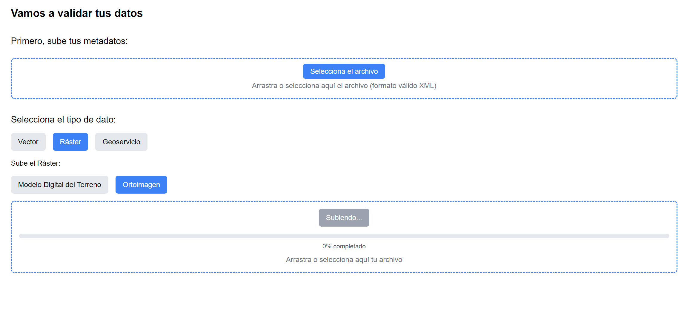

# Frontend de proyecto ICDE-EAFIT (Proyecto - CAOBA)

## Descripción del Proyecto

Esta es la interfaz de usuario que permite a los usuarios cargar y validar diferentes tipos de datos geoespaciales, incluyendo vectores, rásters y geoservicios. La plataforma proporciona una interfaz intuitiva para subir archivos, seleccionar tipos de datos y realizar validaciones automáticas.

## Características Principales

- **Tipos de Datos Soportados**:

  - Vectores (GDB, Polígonos, Líneas, Puntos)
  - Rásters (Modelo Digital del Terreno, Orto-imágenes)
  - Geoservicios (WFS, WMS, WMTS)

- **Funcionalidades**:
  - Carga de metadatos en formato XML
  - Selección dinámica de tipos de datos
  - Validación automática de archivos
  - Soporte para diversos formatos de archivo (ZIP, GPKG, SHP, TIF, IMG)
  - Procesamiento y subida de archivos a Amazon S3
  - Validación de datos con múltiples criterios

## Tecnologías Utilizadas

- **Frontend**:

  - React
  - Next.js
  - Tailwind CSS
  - Hooks de React (useState)

- **Backend**:

  - AWS S3 para almacenamiento
  - Servicio de procesamiento de datos personalizado en AWS Lambda y EC2

- **Bibliotecas Principales**:
  - @aws-sdk/client-s3
  - JSZip
  - fetch API

## Requisitos Previos

- Node.js (v14 o superior)
- Cuenta de AWS con permisos de S3
- Variables de entorno configuradas:
  - NEXT_PUBLIC_AWS_ACCESS_KEY_ID
  - NEXT_PUBLIC_AWS_SECRET_ACCESS_KEY
  - NEXT_PUBLIC_AWS_SESSION_TOKEN
  - NEXT_PUBLIC_AWS_BUCKET_NAME
  - NEXT_PUBLIC_SERVER_IP

## Instalación

1. Clonar el repositorio

```bash
git clone https://github.com/tduqueg/icde-validator.git
cd icde-validator
```

2. Instalar dependencias

```bash
npm install
```

3. Configurar variables de entorno

- Crear un archivo `.env`
- Añadir las variables de entorno necesarias

4. Iniciar la aplicación

```bash
npm run dev
```

5. Acceder a la aplicación en `http://localhost:3000`

6. Ejemplo de visualización
   

## Flujo de Uso

1. **Subir Metadatos**:

   - Seleccionar un archivo XML con metadatos
   - El archivo debe cumplir con los estándares de metadatos geoespaciales

2. **Seleccionar Tipo de Dato**:

   - Vector
   - Ráster
   - Geoservicio

3. **Subir Archivos**:
   - Seleccionar subtipo específico
   - Arrastrar o seleccionar archivo
   - Soporta múltiples formatos según el tipo de dato

## Validaciones Realizadas

La aplicación realiza múltiples validaciones automáticas, incluyendo:

- Valores nulos
- Consistencia de origen geográfico
- Errores de superposición
- Verificación de bandas (para rásters)
- Integridad de archivos GDB

## Estructura del Proyecto

```
/src
├── components
│   ├── DataUpload.js
│   ├── MetadataTypeSelector.js
│   └── MetadataUpload.js
├── page.js
├── layout.js
├── .env
└── styles
    └── globals.css
    └── tailwind.css

```
